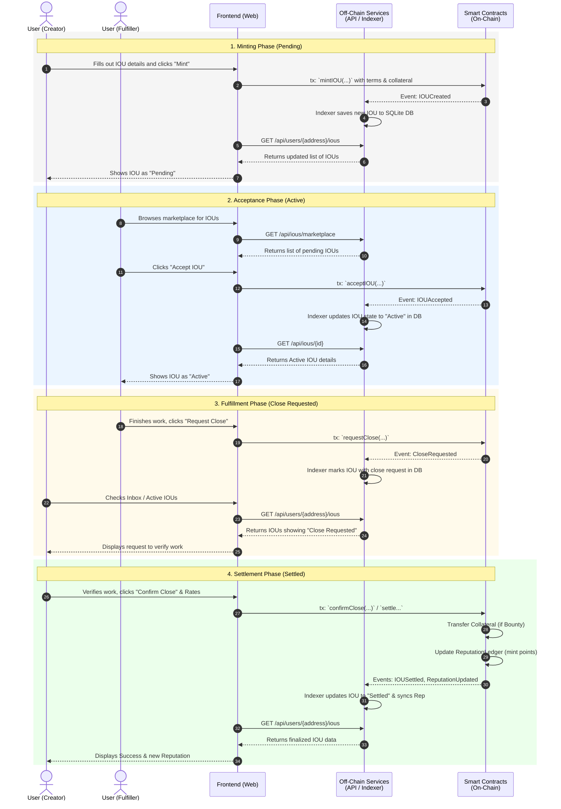
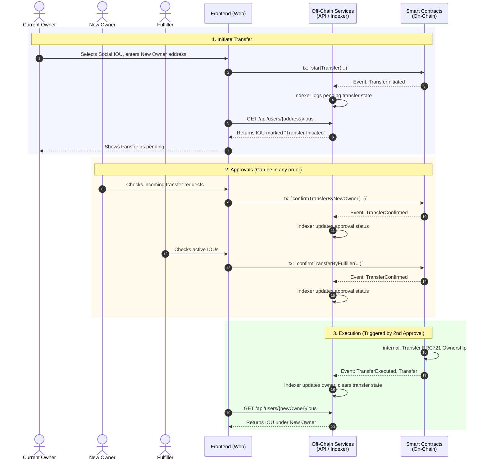

# System Interaction Sequence During IOU Lifecycle

This document illustrates the interactions between the three main components of the IOUFi ecosystem during the lifecycle of an IOU:
1. **The Frontend (Web)**: The user interface where users (Creators and Fulfillers) interact with the application.
2. **Off-Chain Services**: The Indexer and Query API that listen to blockchain events and serve aggregated data.
3. **Smart Contracts (On-Chain)**: The core blockchain logic (`IOUNFT`, `ReputationLedger`, etc.) maintaining the actual state.

## Overview

The standard lifecycle of an IOU involves four major phases:
1. **Minting (Pending State)**: A Creator proposes a new IOU.
2. **Acceptance (Active State)**: A Fulfiller agrees to the terms and takes on the task.
3. **Fulfillment (Close Requested)**: The Fulfiller completes the work and requests the Creator to close the IOU.
4. **Settlement (Settled State)**: The Creator confirms the work, triggering collateral payouts (if any) and reputation updates.

Throughout all phases, the typical pattern is:
1. User acts via the **Frontend**.
2. **Frontend** submits a transaction to the **Smart Contracts**.
3. **Smart Contracts** execute logic and emit events.
4. **Off-Chain Services (Indexer)** catch these events and update the read-optimized database.
5. **Frontend** queries **Off-Chain Services (API)** to quickly display the updated state to users without needing heavy blockchain reads.

## Sequence Diagram

## Transferring Social IOU Flow

For Social IOUs (where no collateral is locked), the current owner can transfer the IOU to a new owner. This is a multi-signature process requiring consent from both the new owner and the fulfiller.

## Failure/Edge Cases (Timeouts and Rejections)

In addition to the happy path, the system handles edge cases using the same interaction paradigm:
- **Refund / Cancel**: A Creator can call `refundPending()` before an IOU is accepted. The contract emits an cancellation event, the indexer updates the DB, and the UI reflects the cancelled state.
- **Reject Close**: If the Creator is unhappy with the work, they call `rejectClose()`. The system stays in the `Active` state, an event is emitted, and the UI clears the close request flag so the Fulfiller can keep working.
- **Timeout**: If the Fulfiller disappears and the deadline passes, the Creator can call `timeoutClaim()`. This emits a cancellation event, refunds the Creator's collateral, and marks the IOU as cancelled in the off-chain DB.
