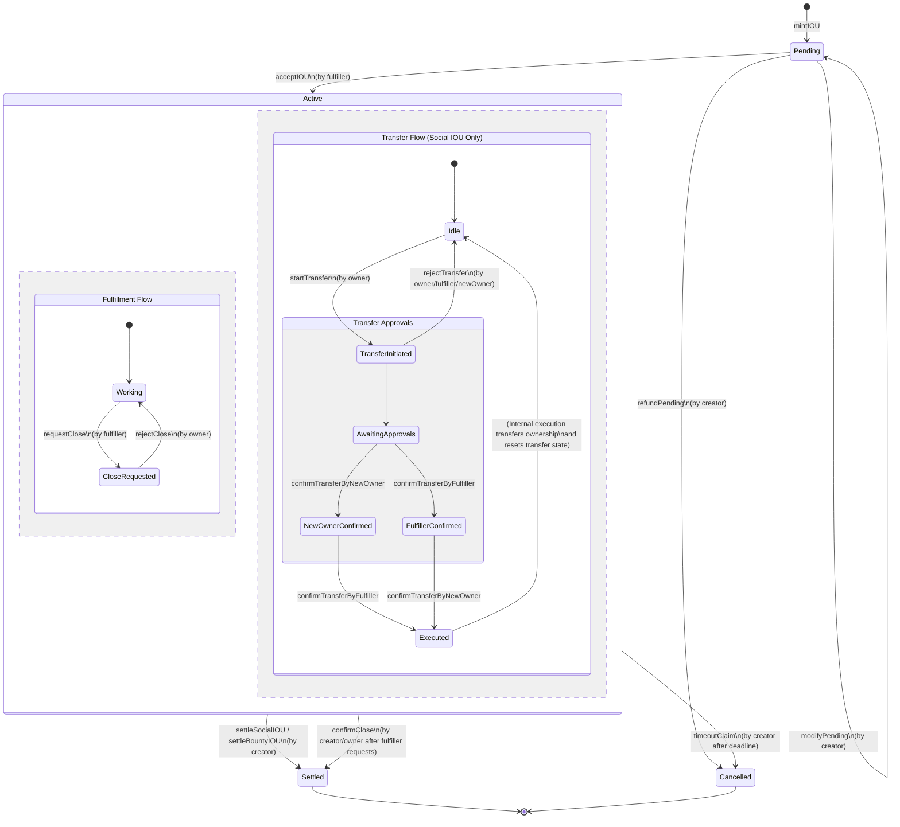

# IOUNFT Life Cycle State Machine

The following state machine diagram illustrates the life cycle of an IOUNFT (IOU Non-Fungible Token) as defined in the `IOUNFT.sol` smart contract.

## Diagram

## State Descriptions

*   **Pending**: The initial state when an IOU is minted. The creator has defined the terms, and the IOU is waiting for a fulfiller to accept it.
    *   *Transitions*: Can be modified (`modifyPending`), cancelled/refunded (`refundPending`), or moved to Active if accepted (`acceptIOU`).
*   **Active**: The IOU is actively being worked on by the fulfiller.
    *   *Sub-flows*:
        *   **Fulfillment Flow**: The fulfiller can request closure (`requestClose`) if they believe the work is done. The owner can reject this request (`rejectClose`).
        *   **Transfer Flow**: For Social IOUs (0 collateral), the owner can initiate a transfer of ownership (`startTransfer`). This requires confirmation from both the new owner and the fulfiller.
    *   *Transitions*: Can be settled by the creator/owner (`settleSocialIOU`, `settleBountyIOU`, or `confirmClose`), or cancelled if the deadline passes (`timeoutClaim`).
*   **Settled**: The final success state. The IOU has been resolved, reputation has been awarded, and any collateral has been paid out or marketplace fees collected. No further actions can be taken.
*   **Cancelled**: The final failure/abort state. The IOU was either cancelled before acceptance or expired without successful settlement. Any collateral is refunded to the creator. No further actions can be taken.
